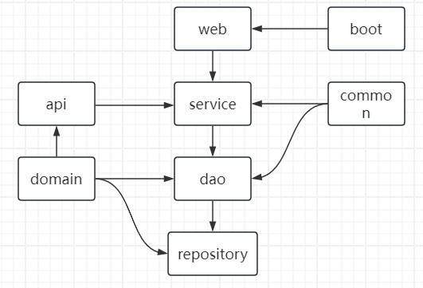

# 模块设计
## 模块定义
### boot
启动模块
(包含@Configuration)
### web
(@Controller、从请求上下文中获取用户信息)
### api
(对外接口以及feignApi调用接口)
### service
(实现事务控制，入参格式必填校验，返回结果需要用CommonResult<XXVO>包装，可以处理失败的情况返回错误消息，
分布式锁)
### dao
(原子类数据库增删改查接口，可以拦截增加缓存配置如redis，实现分页功能)
### common
(@Annotation,Enum,Utils,Constants)
### repository
(Mybatis mapper接口、mapper.xml、多数据库xml支持)
### domain
(定义实体类Data Transfer Objects, DTO)防止下层对象体直接暴露给外部服务，导致底层任何变化都有可能直接传递到外部
--==-->如果只有一个实体对象，那如果表加了一个字段（不想暴露），则直接对外接口也返回了这个字段
View Objects, VO用于对外接口展示

## 模块关系图

## 其他小功能点
##### 1.dozer实现bean的深度拷贝
##### 2.dynamicNacos动态实时读取nacos上的复杂配置
##### 3.StringOptional扩展Optional判断空字符串
##### 4.使用maven的profile来实现打jar包，war包和指定的数据库驱动包
##### 5.拦截dao层方法，AOP实现对增（雪花ID，创建时间，创建者）、改（修改时间、修改者）的增强
##### 6.全局流水号
##### 7.使用OperatorRouter<Enum, Operator>实现根据枚举值调用不同的处理类

